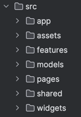

## ЧатПрактикум

Проект на стадии разработки, посмотреть можно [тут](https://melodious-kangaroo-d0bb12.netlify.app/)

### [Макет](https://www.figma.com/file/SSOn9QgZ0XkJKI1lelkQ8t/%D0%9C%D0%B5%D1%81%D1%81%D0%B5%D0%BD%D0%B4%D0%B6%D0%B5%D1%80-%D0%BF%D1%80%D0%B0%D0%BA%D1%82%D0%B8%D0%BA%D1%83%D0%BC?type=design&node-id=0-1&mode=design&t=I44loUCw6nDdPN7a-0)

ЧатПрактикум это мессенджер, написанный в рамках курса Я.Практикум на курсе Мидл-фронтенд разработчик.
Используемый стек:

- handlebars
- vite
- typescript
- express
- sass/scss
- WebSockets
- mocha, chai, sinon
- husky

В данный момент переход по сайту осуществляется по прямым ссылкам внутри страниц, также можно ознакомится со всеми доступными путями в файле `src/widgets/router`.

## Компоненты

Добавила компонентный подход в проект с помощью реализацию блока Component и Event Bus

В проект добавлены ручки, соответствующие требованиям задания из [swagger](https://ya-praktikum.tech/api/v2/swagger/). Добалена возможность поястоянного соединения при помощи веб-сокетов, чаты и сообщения обновляются, можно писать/отправлять/получать сообщения в реальном времени.

#### Component

Абстрактный класс, выполненный на основе класса Block из курса. Изменила передачу пропсов и children, по сравнению с примером они передаются в компонент, типизированы коомпонентами, которые отрисуются. Такой подход позволил мне удобно работать напрямую с children.
EventBus следит за событиями и обноалениями.

реализация компонента на основе абстрактного класса реализуется следующим образом:

```typescript
import componentTemplate from './componentTemplate.template.ts';

export class CustomComponent extends Component<
  CustomComponentProps,
  CustomComponentChildren
> {
  constructor() {
    const props = {
      props: TDefaultProps, // Дефолтный тип пропса
      children: CustomComponentChildren, // Потомки в компоненте
    };
    super(tag, props);
  }

  render() {
    // Если компонент имеет темплейт на Handlebars
    const template = Handlebars.compile(componentTemplate);
    return this.compile(template);
  }
}
```

Более подробно можно посмотреть в проекте, примеры с children например в pages.

#### Store

Класс для работы с состоянием приложения. Реализованы два метода, достаточных для работы setState и getState. Также добавлен класс-обертка **connect** для компонентов класса Component для поддержания актального состояния.

#### HTTPTransport

Класс для работы с запросами обертка для XMLHttpRequest. Реализованы методы GET, POST, PUT, DELETE. Добавила работу с query string в GET-запросе.

#### WSTransport

Класс для работы с веб-сокетами. Реализована прослушка основных событий, пинг на удержания соединения открытым.

#### MessagesController

Класс для работы с WSTransport. Реализована работа с событиями сокета через компоненты.

### Файловая структура

Организовала структуру файлов на основе [FSD](https://feature-sliced.design/ru/docs/get-started/overview) c некоторыми упрощениями и допущениями на свой лад.
Основа:



Где часть папок основаны на спецификации fsd - например, shared, pages, widgets, features - содержат шаренный компоненты, функции, стили и свг иконки, страницы проекта, готовые группы шаренных компонентов в единую структуру с БЛ, легкие структуры соотв.
Компоненты в основном содержат ui и lib папки. UI содержит компоненту, темплейт и стили и доп компоненты, LIB - типы, вспомогательные функции и контекст.

## Тесты

Добавлены тесты на Component, Router, HTTPTransport. Использовала mocha, chai, sinon, постаралась проверить основной функционал.

А также добавлена линтинг и запуск тестов на pre-commit при помощи husky

## Установка и запуск

- `npm install` — установка стабильной версии,
- `npm run dev` — запуск версии для разработчика,
- `npm run start` — сборка и запуск на порту 3000,
- `npm run build` — сборка стабильной версии.
- `npm run lint` — запускает линтер и преттиер для проверки кода и фикс по правилам.
- `npm run test` — запускает тесты.
